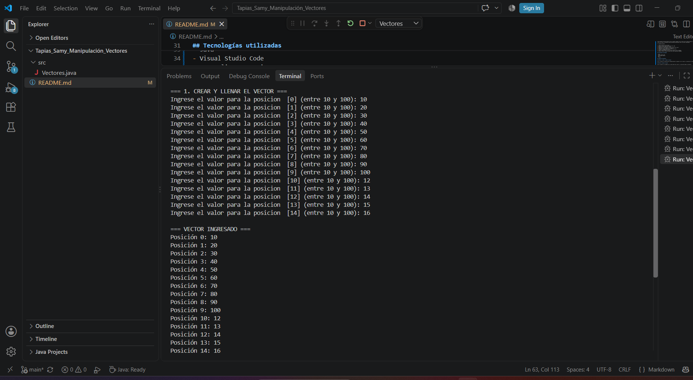
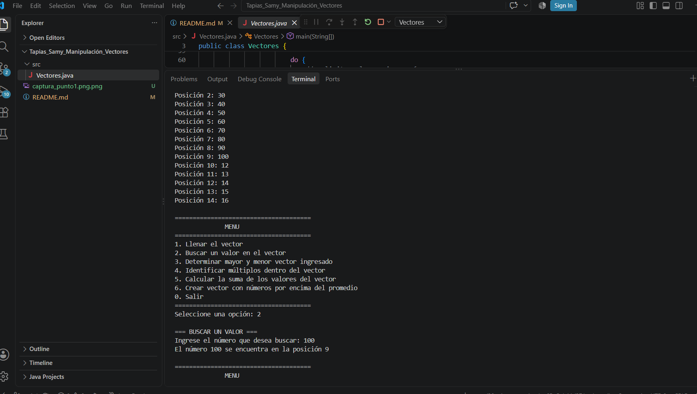
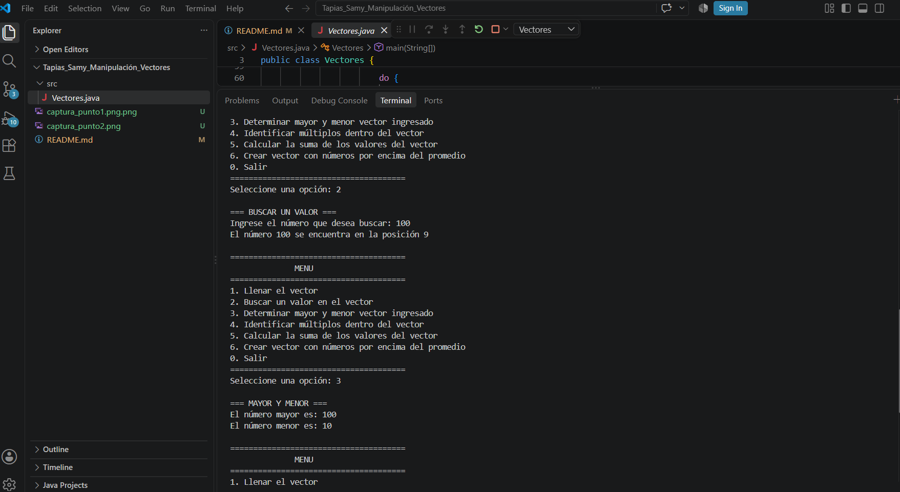
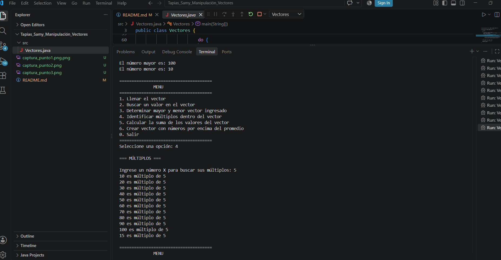
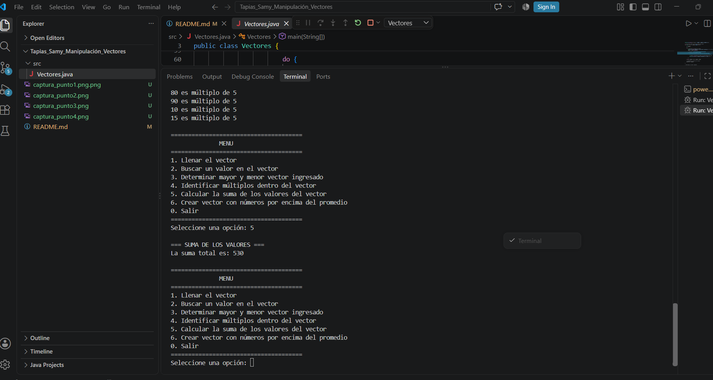
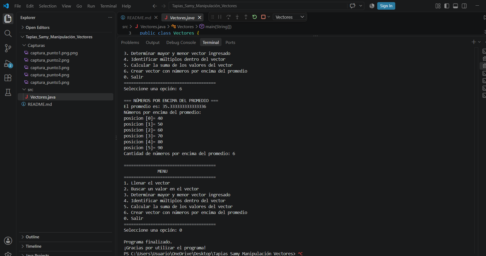

## Operaciones con Vectores en Java

## Datos del estudiante

**Nombre:** Samy Mallerly Tapias Puerta

**Carrera:** Ingeniería en Software y Datos

**Evidencia:** Manipulación de Vectores en Java

## Objetivo

El objetivo de esta actividad es practicar operaciones con vectores en Java, como la búsqueda de valores, la determinación del mayor y menor valor que fueron ingresados, la identificación de múltiplos, el cálculo de la suma y el promedio, y la creación de un nuevo vector con los números que están por encima del promedio.

## Descripción del programa

Este programa fue desarrollado en Java y permite trabajar con un vector de 15 números enteros. El usuario debe ingresar valores entre 10 y 100 y el programa realiza diferentes operaciones sobre los datos almacenados.

El programa permite:

1. Crear un vector de 15 números.
2. Validar que los números estén entre 10 y 100.
3. Buscar un valor dentro del vector.
4. Encontrar el número mayor y el menor dentro del vector.
5. Identificar los múltiplos de un número x.
6. Calcular la suma de todos los valores del vector.
7. Calcular el promedio del vector.
8. Crear un nuevo vector con los números mayores que el promedio.
9. Mostrar cuáles y cuántos números están por encima del promedio.

## Tecnologías utilizadas

- Java
- Visual Studio Code
- JDK Eclipse Temurin
- Git
- GitHub

## Operaciones realizadas

### 1. Crear un vector de 15 números

El programa crea un vector de 15 números enteros y solicita al usuario ingresar valores entre 10 y 100. Si el número ingresado está fuera del rango permitido, el programa muestra un mensaje de error y vuelve a solicitar el valor. Al completar el vector, se muestran los valores ingresados en la consola.

### 2. Buscar un valor en el vector

El programa solicita al usuario un número para buscar dentro del vector. Utiliza un ciclo para recorrer los elementos y, si encuentra el número, muestra la posición en la que se encuentra. Si el número no está en el vector, muestra un mensaje indicando que no fue encontrado.

### 3. Determinar el mayor y el menor valor

El programa recorre el vector para determinar cuál es el número mayor y cuál es el número menor. Al finalizar, muestra ambos valores en la consola.

### 4. Identificar múltiplos de un número

El programa solicita al usuario un número X y recorre el vector para identificar todos los elementos que son múltiplos de X. Si no encuentra ningún múltiplo, muestra un mensaje indicando que no hay múltiplos de ese número.

### 5. Calcular la suma de todos los valores

El programa recorre todos los elementos del vector y calcula la suma de los valores almacenados. Al finalizar, muestra la suma total en la consola.

### 6. Crear un nuevo vector con números por encima del promedio

El programa calcula el promedio de los valores del vector original y crea un nuevo vector que contiene únicamente los números mayores que dicho promedio. Finalmente, muestra cuáles son esos números y cuántos valores se encuentran por encima del promedio.

## Capturas de pantalla

### Punto 1: Crear y llenar el vector

Aquí se muestra la ejecución del programa donde se ingresan los 15 números y se muestran los valores almacenados en el vector.



### Punto 2: Buscar un valor

Aquí se muestra la búsqueda de un número dentro del vector y la posición donde se encuentra.


### Punto 3: Mayor y menor

Aquí se muestra el número mayor y el número menor encontrados en el vector.



### Punto 4: Múltiplos

Aquí se muestran los números del vector que son múltiplos del número ingresado por el usuario.



### Punto 5: Suma

Aquí se muestra la suma total de los valores del vector.



### Punto 6: Promedio y números por encima del promedio

Aquí se muestra el promedio, los números que están por encima del promedio y la cantidad de números encontrados.



## Cómo ejecutar el programa

1. Abrir la carpeta del proyecto en Visual Studio Code.
2. Abrir la carpeta `src`.
3. Abrir el archivo `Vectores.java`.
4. Verificar que el JDK de Eclipse Temurin esté instalado y configurado.
5. Presionar el botón **Run** o ejecutar el programa desde la terminal.
6. Seguir las instrucciones que aparecen en la consola.

## Estructura del proyecto

El proyecto está organizado de la siguiente manera:

```text
Tapias_Samy_Manipulación_Vectores/
├── src/
│   └── Vectores.java
├── capturas/
│   ├── captura_punto1.png
│   ├── captura_punto2.png
│   ├── captura_punto3.png
│   ├── captura_punto4.png
│   ├── captura_punto5.png
│   └── captura_punto6.png
└── README.md
´´
##


